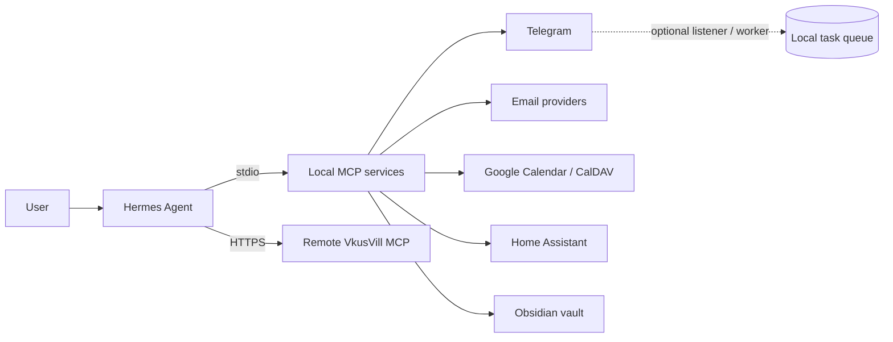

tests/         process-level integration tests
# Personal AI Assistant

[Русская версия](README.md) · [Deployment guide](deployment/README.md) · [Reusable skills](skills/README.md)

A personal assistant that connects [Hermes Agent](https://github.com/NousResearch/hermes-agent) to messaging, email, calendars, Home Assistant, and notes. Integrations run as separate services, so you can enable only the tools you intend to use and expand the setup over time.

> Self-hosted does not mean every request stays on your machine: local MCPs contact their providers, and VkusVill is a remote MCP. This guide calls out where data goes and which tools can change state.

## Contents

- [Integrations](#integrations)
- [Architecture](#architecture)
- [Quick start](#quick-start)
- [Access and security](#access-and-security)
- [Run and operate](#run-and-operate)
- [Checks and updates](#checks-and-updates)
- [Project layout](#project-layout)
- [Documentation](#documentation)

## Integrations

| Integration | Capabilities | Writes and important limits |
| --- | --- | --- |
| [Telegram](mcp/telegram/README.md) | Search and read chats, send messages, run background tasks for selected conversations | A listener and worker can autonomously reply in chats attached to a task. This is an opt-in operating mode; understand it before enabling it. |
| [Email](mcp/email/README.md) | Multiple Gmail or IMAP/SMTP accounts, search/read, drafts and replies | Sending requires account-level `allow_send` and `user_confirmed=true`. That argument is an MCP check, not a separate Hermes UI confirmation. |
| [Calendar](mcp/calendar/README.md) | Read events and free slots across Google Calendar and CalDAV accounts | Create/delete use short-lived proposals and a confirmation workflow. Writes are limited to a configured calendar; event edits and recurring events are unsupported. |
| [Home Assistant](mcp/homeassistant/README.md) | Find entities by name or room, read states, devices, history, and location | Control is disabled by default, enabled through configuration, and restricted to allowed domains. Write tools have no separate built-in per-action human confirmation. |
| [Obsidian](mcp/obsidian/README.md) | Search, read, create, and append Markdown notes in one vault | Writes are confined to the configured vault. The MCP can also send a note through Telegram. |
| [VkusVill](mcp/vkusvill/README.md) | Search products and recipes, build a cart | Remote MCP: requests go to an external service. Hermes marks it `untrusted`; the user remains responsible for checkout and payment. |

Reusable, profile-independent workflows are in [Hermes skills](skills/README.md). Skills do not replace MCP setup and do not contain your credentials.

## Architecture

Hermes handles the conversation and invokes MCP tools. Five local MCP services are installed independently; VkusVill connects over HTTPS. Providers (Telegram, Google, CalDAV, Home Assistant, and the Obsidian vault) remain the source of data and actions.



Each local MCP has its own `pyproject.toml`, `uv.lock`, `.venv`, and `.env`. Hermes launches them as separate processes. Telegram has optional listener, worker, and notifier processes; Home Assistant has an optional location recorder.

## Quick start

Supported platforms: Linux and macOS. Requirements: Git, Python **3.11–3.13**, and [`uv`](https://docs.astral.sh/uv/). Install as a regular user, not `root`.

```bash
git clone --recurse-submodules https://github.com/goshkaaa/Personal-AI-assistant.git
cd Personal-AI-assistant
make setup
.venv/bin/hermes setup
```

`make setup` initializes the Hermes submodule, creates separate environments for the five local MCPs, copies `.env.example` only when `.env` does not exist, creates private directories, and generates `.local/hermes-mcp.yaml`. This installs the full local stack; individual MCP packages also have standalone instructions in their READMEs.

### 1. Configure only the integrations you need

Fill in the relevant `mcp/<service>/.env` and create credentials as described in the [deployment guide](deployment/README.md). Prefer separate files under `~/.config/personal-ai-assistant/secrets/` for OAuth tokens, app passwords, and the Home Assistant token; put their paths in `.env` rather than the secret values.

Authorization commands are integration-specific. For example:

```bash
mcp/telegram/.venv/bin/telegram-login
mcp/telegram/.venv/bin/telegram-listener-login
mcp/email/.venv/bin/email-auth --account <account-id>
mcp/calendar/.venv/bin/calendar-auth --account <account-id>
```

IMAP/SMTP and CalDAV have separate password-storage commands. See each integration README for account examples and credential setup.

### 2. Connect MCPs to Hermes

```bash
make config
```

Copy **only configured** entries from `.local/hermes-mcp.yaml` into the existing `mcp_servers` section of `~/.hermes/config.yaml`; do not add a second `mcp_servers` key. The generator enables all six entries, including unconfigured local servers and remote VkusVill, so disable anything you have not set up. The generated file contains absolute local paths, is private, and must not be committed.

### 3. Validate the setup

```bash
make check
```

Start with read-only workflows for each enabled integration. Before enabling writes, review which tools Hermes can call and the trust level assigned to each MCP.

## Access and security

Generated local MCP entries use `trust: full`. Hermes's standard approval prompt is **not a safety boundary for write tools on those entries**. Treat every enabled local MCP as a trusted tool and limit its configuration and connected accounts accordingly.

| Operation | What gates it |
| --- | --- |
| Email send/reply | Account `allow_send` and `user_confirmed=true`; the latter is a tool argument, not an independent Hermes confirmation dialog. |
| Calendar create/delete | Allowed account/calendar, a short-lived proposal, and an explicit confirmation workflow. |
| Home Assistant services | Disabled by default; requires `MCP_ALLOW_HOME_ASSISTANT_WRITE=true`; allowlists and dangerous-service blocks apply. This is not a per-action user confirmation. |
| Telegram task replies | Once a task is attached, the listener forwards incoming events to a worker that can reply without approval for every message. |
| Obsidian writes | Local tools can write to the configured vault; there is no external approval prompt when configured as `trust: full`. |
| VkusVill | Remote endpoint and `trust: untrusted`; review requests and confirm any purchase yourself. |

Never commit `.env`, API/OAuth tokens, app passwords, Telegram sessions, SQLite files, logs, backups, private Hermes config/SOUL/memory, generated `.local/`, or real coordinates. Runtime data defaults to `~/.local/share/personal-ai-assistant/`; credentials default to `~/.config/personal-ai-assistant/secrets/`.

### Home Assistant and location

State and registry reads are separate from device control. Home Assistant's technical `not_home` state means only that an entity is outside the configured HA home zone; it does not describe a person's residence.

The optional recorder stores points for explicitly configured entities. Its default interval is 10 minutes and default retention is 72 hours; retention can be configured up to 720 hours. Enable it only with the consent of the people concerned. Reverse geocoding is off by default; when enabled, coordinates are sent to the configured external endpoint.

## Run and operate

Local Hermes chat:

```bash
.venv/bin/hermes --tui
```

Messaging gateway:

```bash
.venv/bin/hermes gateway setup
.venv/bin/hermes gateway install
.venv/bin/hermes gateway start
.venv/bin/hermes gateway status
```

On Linux, `make services` installs systemd user services for the Telegram listener/worker/notifier and the Home Assistant recorder if configured. These are separate background processes; this target uses systemd and is not for macOS.

## Checks and updates

```bash
make check          # lint, format, compile, tests, and secret scan
make deploy-check   # make check plus strict operational preflight
```

`make check` requires all five MCP environments to be installed. `make deploy-check` also requires a clean Git worktree, the pinned Hermes submodule revision, and private config permissions. For an uncommitted source-only release candidate, run `make check` and `deployment/preflight.py --allow-dirty --source-only`. These checks do not publish code or deploy services.

Update while keeping runtime data:

```bash
git pull --ff-only
git submodule update --init --recursive
make setup
make deploy-check
.venv/bin/hermes gateway restart
```

Back up `~/.hermes`, secrets, and runtime data outside the checkout before upgrading. See [deployment/README.md](deployment/README.md) for installation, storage layout, and rollback guidance.

## Project layout

```text
deployment/    installation, config generation, operational preflight
mcp/           five local MCP integrations and their documentation
skills/        reusable, sanitized Hermes workflows
tests/         process-level integration and privacy tests
scripts/       shared quality gate and secret scanning
hermes/        pinned Hermes Agent Git submodule
```

Integration guides: [Telegram](mcp/telegram/README.md) · [Email](mcp/email/README.md) · [Calendar](mcp/calendar/README.md) · [Home Assistant](mcp/homeassistant/README.md) · [Obsidian](mcp/obsidian/README.md) · [VkusVill](mcp/vkusvill/README.md).

## License

[MIT](LICENSE) · Release history: [CHANGELOG.md](CHANGELOG.md).
