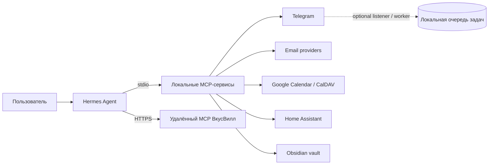

# Personal AI Assistant

[English version](README.en.md) · [Установка и deployment](deployment/README.md) · [Skills](skills/README.md)

Персональный ассистент, который связывает [Hermes Agent](https://github.com/NousResearch/hermes-agent) с вашими повседневными инструментами: перепиской, календарём, умным домом и заметками. Сервисы запускаются отдельно, поэтому можно подключать только нужные интеграции и постепенно расширять систему.

> Это self-hosted проект, а не обещание «всё остаётся на устройстве»: MCP-сервисы обращаются к своим провайдерам, а VkusVill подключается как удалённый MCP. Ниже описано, какие данные куда уходят и какие операции могут менять состояние.

## Содержание

- [Возможности](#возможности)
- [Архитектура](#архитектура)
- [Быстрый старт](#быстрый-старт)
- [Доступы и безопасность](#доступы-и-безопасность)
- [Запуск и фоновые процессы](#запуск-и-фоновые-процессы)
- [Проверки и обновление](#проверки-и-обновление)
- [Структура проекта](#структура-проекта)
- [Документация](#документация)

## Возможности

| Интеграция | Что можно делать | Запись и важные ограничения |
| --- | --- | --- |
| [Telegram](mcp/telegram/README.md) | Искать и читать чаты, отправлять сообщения, запускать фоновые задачи для выбранных диалогов | Listener и worker могут автономно отвечать в чатах, прикреплённых к задаче. Это отдельный режим, включайте его осознанно. |
| [Email](mcp/email/README.md) | Работать с несколькими Gmail или IMAP/SMTP аккаунтами, искать и читать письма, создавать drafts и replies | Отправка требует разрешения `allow_send` для аккаунта и аргумента `user_confirmed=true`. Это проверка MCP, а не отдельный запрос подтверждения интерфейса Hermes. |
| [Calendar](mcp/calendar/README.md) | Читать события и свободные интервалы Google Calendar и CalDAV, работать с несколькими аккаунтами | Создание и удаление проходят через короткоживущие предложения и подтверждение. Запись ограничивается настроенным календарём; редактирование событий и recurring events не поддерживается. |
| [Home Assistant](mcp/homeassistant/README.md) | Искать entities по имени и комнате, читать состояния, устройства, историю и местоположение | Управление по умолчанию выключено; включается настройкой и ограничено разрешёнными доменами. Для write-tools нет отдельного внутреннего подтверждения каждого действия. |
| [Obsidian](mcp/obsidian/README.md) | Искать, читать, создавать и дополнять Markdown-заметки в одном vault | Запись ограничена каталогом vault. MCP также умеет передать заметку в Telegram. |
| [ВкусВилл](mcp/vkusvill/README.md) | Искать товары и рецепты, формировать корзину | Это удалённый MCP: запросы уходят внешнему сервису. В Hermes он помечен как `untrusted`; оформление и оплата остаются за пользователем. |

Для повторяемых сценариев есть [обезличенные Hermes skills](skills/README.md). Skills не заменяют настройки MCP и не содержат ваши учётные данные.

## Архитектура

Hermes ведёт диалог и вызывает MCP-инструменты. Пять локальных MCP-сервисов устанавливаются независимо; VkusVill подключается по HTTPS. Провайдеры (Telegram, Google, CalDAV, Home Assistant, Obsidian vault) остаются источниками данных и действий.



Каждый локальный MCP имеет собственные `pyproject.toml`, `uv.lock`, `.venv` и `.env`. Hermes запускает их как отдельные процессы. Для Telegram доступны дополнительные listener, worker и notifier; для Home Assistant — опциональный recorder истории геопозиции.

## Быстрый старт

Поддерживаются Linux и macOS. Нужны Git, Python **3.11–3.13** и [`uv`](https://docs.astral.sh/uv/). Установку выполняйте обычным пользователем, не от `root`.

```bash
git clone --recurse-submodules https://github.com/goshkaaa/Personal-AI-assistant.git
cd Personal-AI-assistant
make setup
.venv/bin/hermes setup
```

`make setup` инициализирует Hermes submodule, создаёт отдельные окружения для пяти локальных MCP, копирует `.env.example` только если `.env` ещё нет, создаёт приватные каталоги и генерирует `.local/hermes-mcp.yaml`. Установить все компоненты сразу удобно для первого запуска; отдельные пакеты также описаны в своих README.

### 1. Настройте только нужные интеграции

Заполните соответствующие `mcp/<service>/.env` и создайте учётные данные по [deployment guide](deployment/README.md). Для OAuth-токенов, app passwords и HA token предпочтительны отдельные файлы в `~/.config/personal-ai-assistant/secrets/`; в `.env` храните путь к файлу, а не сам секрет.

Авторизация выполняется командами конкретного модуля, например:

```bash
mcp/telegram/.venv/bin/telegram-login
mcp/telegram/.venv/bin/telegram-listener-login
mcp/email/.venv/bin/email-auth --account <account-id>
mcp/calendar/.venv/bin/calendar-auth --account <account-id>
```

Для IMAP/SMTP и CalDAV предусмотрены отдельные команды сохранения пароля; подробности и примеры accounts — в README соответствующей интеграции.

### 2. Подключите MCP к Hermes

```bash
make config
```

Скопируйте **только настроенные** entries из `.local/hermes-mcp.yaml` в существующий `mcp_servers` файла `~/.hermes/config.yaml`. Не создавайте второй ключ `mcp_servers`. Генератор включает все шесть интеграций, в том числе ещё не настроенные локальные MCP и удалённый ВкусВилл, поэтому отключите ненужные записи. Файл содержит абсолютные локальные пути, имеет приватные права и не должен попадать в Git.

### 3. Проверьте конфигурацию

```bash
make check
```

Сначала проверьте безопасные read-only сценарии в каждом включённом MCP. Не включайте write-доступ, пока не проверили, какие tools может вызывать Hermes и с каким уровнем доверия.

## Доступы и безопасность

В сгенерированном конфиге локальные MCP имеют `trust: full`. Для них стандартный approval prompt Hermes **не является защитой от вызова write-tools**. Рассматривайте каждый включённый MCP как доверенный локальный инструмент и ограничивайте его конфигурацией и доступными аккаунтами.

| Операция | Что её ограничивает |
| --- | --- |
| Email send/reply | Настройка `allow_send` и `user_confirmed=true`; последнее — аргумент инструмента, а не независимый диалог подтверждения Hermes. |
| Calendar create/delete | Разрешённый аккаунт/календарь, временное предложение и явный workflow подтверждения. |
| Home Assistant services | По умолчанию выключены; необходим `MCP_ALLOW_HOME_ASSISTANT_WRITE=true`, действуют allowlist и блокировка опасных сервисов. Не считайте это подтверждением пользователя на каждое действие. |
| Telegram task replies | После прикрепления задачи listener передаёт входящие события worker-у, который может отвечать без подтверждения каждого сообщения. |
| Obsidian writes | Локальные инструменты могут записывать в настроенный vault; внешнего approval prompt при `trust: full` нет. |
| ВкусВилл | Удалённый endpoint и `trust: untrusted`; проверяйте отправляемые запросы и подтверждайте покупку самостоятельно. |

Не коммитьте `.env`, OAuth/API-токены, app passwords, Telegram sessions, SQLite, логи, backups, приватные Hermes config/SOUL/memory, сгенерированный `.local/` и реальные координаты. Runtime-данные по умолчанию лежат в `~/.local/share/personal-ai-assistant/`, credentials — в `~/.config/personal-ai-assistant/secrets/`.

### Home Assistant и геопозиция

Чтение состояний и registry отделено от управления устройствами. Технический state `not_home` означает только нахождение вне настроенной домашней зоны Home Assistant, а не место жительства человека.

Опциональный recorder может сохранять точки для явно настроенных entities. Интервал по умолчанию — 10 минут, retention — 72 часа; срок можно настроить до 720 часов. Включайте запись только с согласием людей, которых она касается. Reverse geocoding выключен по умолчанию; при включении координаты передаются указанному внешнему endpoint.

## Запуск и фоновые процессы

Локальный чат Hermes:

```bash
.venv/bin/hermes --tui
```

Gateway для подключённых каналов:

```bash
.venv/bin/hermes gateway setup
.venv/bin/hermes gateway install
.venv/bin/hermes gateway start
.venv/bin/hermes gateway status
```

На Linux `make services` устанавливает systemd user services для Telegram listener/worker/notifier и Home Assistant recorder, если он настроен. Это отдельные фоновые процессы; команда рассчитана на systemd и не предназначена для macOS.

## Проверки и обновление

```bash
make check          # lint, format, compile, тесты и secret scan
make deploy-check   # make check + строгий operational preflight
```

`make check` требует установленных окружений всех пяти MCP. `make deploy-check` дополнительно требует чистое дерево Git, корректную версию Hermes submodule и приватные права конфигурации. Для незакоммиченного source-only release candidate используйте `make check` и `deployment/preflight.py --allow-dirty --source-only`. Проверки не публикуют код и не выполняют deployment.

Обновление с сохранением runtime-данных:

```bash
git pull --ff-only
git submodule update --init --recursive
make setup
make deploy-check
.venv/bin/hermes gateway restart
```

Перед обновлением сделайте резервную копию `~/.hermes`, secrets и runtime data вне checkout. Подробная установка, storage layout и rollback: [deployment/README.md](deployment/README.md).

## Структура проекта

```text
deployment/    установка, генерация конфигурации и operational preflight
mcp/           пять локальных MCP и документация интеграций
skills/        повторно используемые обезличенные сценарии Hermes
tests/         process-level integration и privacy tests
scripts/       единый quality gate и проверка секретов
hermes/        Hermes Agent, закреплённый Git submodule
```

Архитектура, setup и ограничения конкретных интеграций:
[Telegram](mcp/telegram/README.md) · [Email](mcp/email/README.md) · [Calendar](mcp/calendar/README.md) · [Home Assistant](mcp/homeassistant/README.md) · [Obsidian](mcp/obsidian/README.md) · [ВкусВилл](mcp/vkusvill/README.md).

## Лицензия

[MIT](LICENSE) · История релизов — [CHANGELOG.md](CHANGELOG.md).
